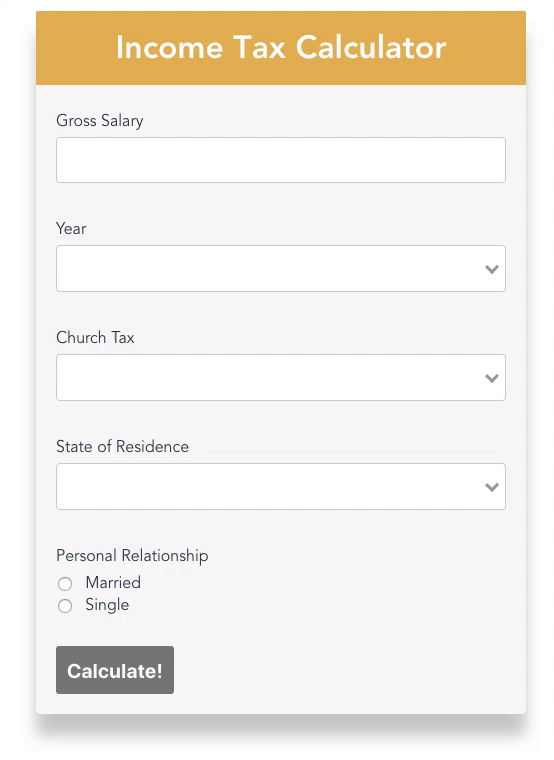
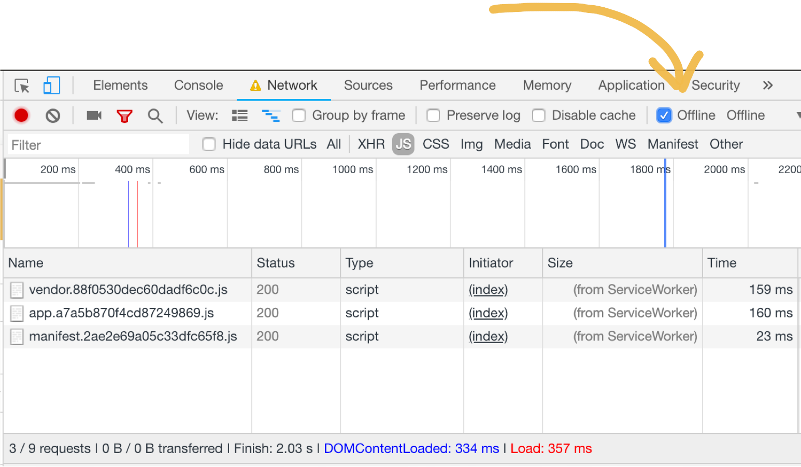
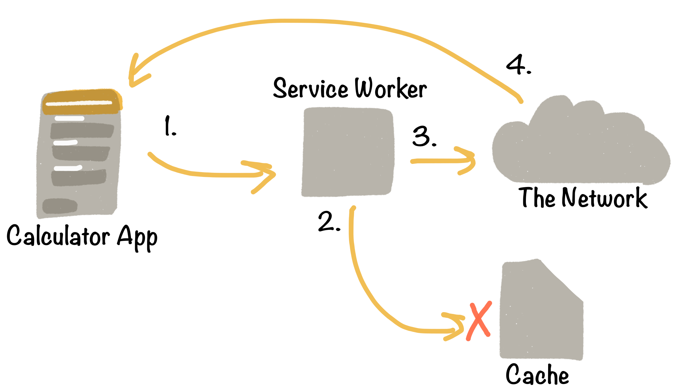
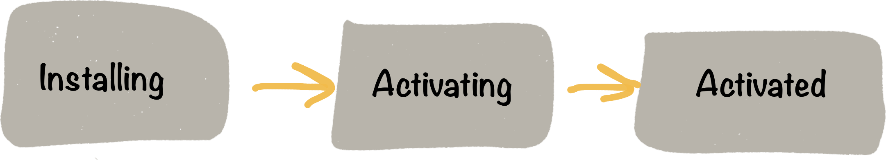

In this tutorial, we will implement and discuss the Service Worker, one of the core technologies that adds the astonishing offline-first experience of a native app to a regular web app.

In fact, this article is the second part of a series that teaches you how to develop a so called progressive web app in VueJS!

Part I — Build the Tax Calculator App in VueJS.

**Part II — Make the App work offline.**

No worries if you haven’t done Part I you can also start straight into building PWA features. Let’s get going!

## Offline-first Paradigm

On the web of today the majority of websites and web apps simply fail when there is no network connection. This is so common, that users of today don’t even complain about this poor experience.

For Progressive Web Apps it’s different, as these bridge the gap between native and web applications. In contrast to the web, native app users do not simply accept complete crashes due to poor network connectivity.

Thats why building PWAs does not only require new technologies but also a new paradigm to meet these user expectations. This very paradigm is called offline-first! Boiled down to one single sentence:

> Offline-first means always provide the best possible experience based on the users current network conditions.

We jump right into learning what offline-first means for app development by checking out the tax calculator app as our starting point.

## The Tax Calculator App



That’s the VueJS app we have build in Part I of this tutorial. It helps users to calculate German income tax (it’s really tricky) based on some personal details.

To get started with the already completed app check out the `07_complete` branch of this

[Github Repo](https://github.com/fh48/vue-calculator-pwa)

## Let’s make the app work offline!

Let’s start with making our income tax calculator available offline. Typically, all static files (HTML, JS, CSS, images, etc.) are requested again and again with each page refresh. As the tax calculator app does its calculations in the frontend, a server connection is not really required, but for fetching these static files. That means, to make our app available offline we simply need can simply cache them by using a Service Worker!


Sounds not as easy to do, right?

In fact, most of the job is already done. Our app is based on VueJS PWA template that supports pre-caching of static assets out of the box. However, it’s not easy to understand whats going on if you are not familiar with the the concept of **Service Workers** and the **CacheStorage API** yet.

That’s why we start with exploring both topics in this section!

### What is a Service Worker?


A service worker is a script that your browser runs in the background, separate from a web page. It can neither directly interact with the webpage nor directly access the DOM because he service worker runs on a different thread. This nature of service workers opens the door to features that don’t need a web page or user interaction, e.g the interception and management of network requests and including data caching.

Check it our yourself! Go to `webpack.prod.conf` file, thats where we configure `sw-precache` to build a service worker. Look for the `SWPrecacheWebpackPlugin` constructor and change the `minified` option to `false`.

Then, run `yarn build`. When we now check our `/build` folder, we find the service-worker.js file there. Service Workers are a production only feature. Imaging, your app would cache all static files in development mode…not a very pleasant dev experience. That’s why we need to [serve](https://github.com/zeit/serve) our production build in order to ensure it is all working correctly.

```bash
yarn global add serve
```

Then run the following command and browse `http://localhost:3000`

```bash
serve dist/
```

You should see the tax calculator as you know it. Now go to the dev tools, network tab. set the `offline` tick and refresh the page. The app is still there and fully functional!



Great, now we know what a service worker is and how [sw-precache](https://github.com/GoogleChromeLabs/sw-precache) lets us set it up very conveniently. However, we haven’t explored how the service worker actually caches the static files.

### CacheStorage API

First of all, important to understand how caching in general works. Therefore we have a look at the [CacheStorage](https://developer.mozilla.org/en-US/docs/Web/API/CacheStorage) browser API. It’s a fairly new type of caching layer which allows us to explicitly manage the caching of assets. CacheStorage is nothing like AppCache, you might remember. CacheStorage is less opinionated and much more advanced, which gives us a lot more freedom.

CacheStorage is great for our purpose, as it allows us to manage our caching needs on a very granular level. Basically, we can decide individually for each single single how and when to serve it from cache or network. Even though, we can basically come up with very individual cache strategy, there are a few common once, worth knowing.

The most common are cache only, cache falling back to network, network only, network, falling back to cache and generic fallback.

### The Cache-first Strategy



Our `sw-precache` library comes with a `cache-first` strategy.

That means, when the app starts to load its static files(1), the service worker intercepts the requests. Next, the service worker tries to serve the static files from the local cache storage(2). Only if not files are available there, it connects to the network to fetch them(3) and completes the app’s request(4).

Generally speaking, `cache-first` is a good strategy for basic offline-first implementations. However, this strategy comes with some downsides. For example, it prevents that users always see the newest version of the app, as the service worker serves preferably a cached, probably outdated, app version. In the [documentation](https://github.com/GoogleChromeLabs/sw-precache#considerations) of `sw-precache` they recommend compensation this by

> displaying an alert to your users when there’s new content available, and give them an opportunity to reload the page to pick up that new content.

In the case of our tax calculator this isn’t a big problem, otherwise one of the other caching strategies could be a better choice.

### The Service Worker LifeCycle

To successfully implement any of the mentioned caching strategy it’s important to be familiar with the life cycle of a service worker. So let’s look at a simplified version of the actual lifecycle for now. We look at the following stages: _installing_, _activating_ and _activated_. Each of these stages must be completed during the life time of a worker.



When the worker enters one of the stages it emits an event, we can listen to. Now we can checkout how our service worker is actually caching our static files. Don’t let the helper functions confuse you, I highlight for you whats most important.

```javascript
self.addEventListener("install", function(event) {
  event.waitUntil(
    caches
      .open(cacheName)
      .then(function(cache) {
        return setOfCachedUrls(cache).then(function(cachedUrls) {
          return Promise.all(
            Array.from(urlsToCacheKeys.values()).map(function(cacheKey) {
              ...
              return fetch(request).then(function(response) {
                 ...
                return cleanResponse(response).then(function(responseToCache) {
                  return cache.put(cacheKey, responseToCache);
                });
              });
            })
          );
        });
      })
      .then(function() {
        // Force the SW to transition from installing -> active state
        return self.skipWaiting();
      })
  );
});
```

**Install Event**, typically used to cache files which are required to be available, before the service worker is active. For example, requests the service worker relies on to function correctly. If anything goes wrong we simply cancel the installation. Next time the user visits the page, the service worker will try to install again.

If there is new static assets, they are added to the cache by `cache.put(cacheKey, resonseToCache)`, else the worker transitions to the next `stage.event.waitUntil()` is heavily used in service workers to extend the current state till the passed chain of callbacks is resolved.

```javascript
self.addEventListener("activate", function(event) {
  var setOfExpectedUrls = new Set(urlsToCacheKeys.values());

  event.waitUntil(
    caches
      .open(cacheName)
      .then(function(cache) {
        return cache.keys().then(function(existingRequests) {
          return Promise.all(
            existingRequests.map(function(existingRequest) {
              if (!setOfExpectedUrls.has(existingRequest.url)) {
                return cache.delete(existingRequest);
              }
            })
          );
        });
      })
      .then(function() {
        return self.clients.claim();
      })
  );
});
```

**Activate Event**, when a service worker is activated, it takes control of our app. A worker needs to be activated before it can intercept fetch requests. When a worker is initially registered, pages won’t use it until they next load. The `claim()` method forces the service workers to immediately take control of a page. We also can do some more cache management here and delete request from the cache which are not part of our expected URLs anymore.

**Fetch Event**, The fetch event is the only thing which we haven’t seen is how the service worker actually fetches the cached static files. That happens by listening to fetch events.

```javascript
self.addEventListener("fetch", function(event) {
  if (event.request.method === "GET") {
    var shouldRespond;
    ...
    if (shouldRespond) {
      event.respondWith(
        caches
          .open(cacheName)
          .then(function(cache) {
            return cache
              .match(urlsToCacheKeys.get(url))
              .then(function(response) {
                  return response;
                  ...
              });
          })
          .catch(function(e) {
            console.warn(
              'Couldn\'t serve response for "%s" from cache: %O',
              event.request.url,
              e
            );
            return fetch(event.request);
          })
      );
    }
  }
});
```

I skipped how `shouldRespond` is calculated, it’s more important to understand how we return content from cache to all `GET` requests. In case we can’t serve from cache, as we might haven’t cached a requested resource, we simply let the request through, fetching the content from the network.

Don’t forget to go back to your `webpack.prod.conf` file to reset the minified option to `true`.

### Are Service Workers well supported?

You might already wondered about browser and platform support for Service Workers. Long Story short, all major browser vendors and platforms are clearly committed to extend their PWA support.

However, Apple is far behind and it will probably take a long time till they catch up. Just with last year’s iOS 11.3 update Apple started to support the basic features of service workers.

You find more about which Vendors and platforms have committed to support PWAs in the intro of Part I.

That’s all we need to know about Service Workers and Caching for now. We have covered the essential bits and pieces to make our app a true offline-first experience!

## Credits

Originally posted on [Hacker Noon](https://hackernoon.com/build-a-progressive-web-app-in-vuejs-from-zero-to-hero-part-2-the-service-worker-d9babc3d756f).
