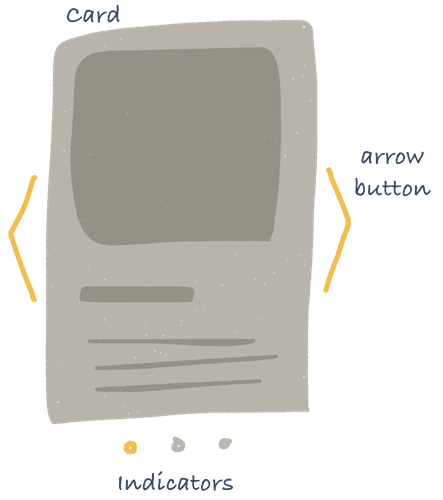
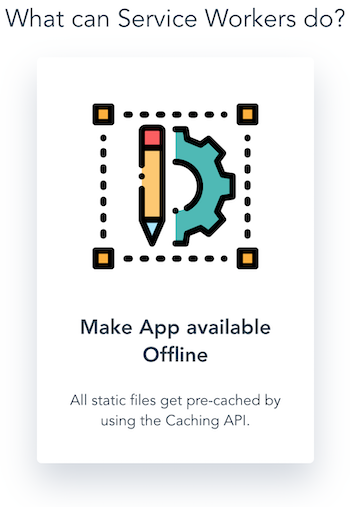
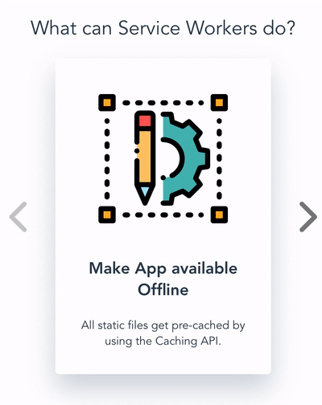

A carousel, slideshow, or slider - however you call it this class of UI - has become one of the core elements used in modern web development. Today, it's almost impossible to find any Website or UI library which doesn't come with one or another kind of carousel.

Why, though? In fact, carousels really deserve their popularity. They allow users to skim through available content without vertical scrolling or heavy mouse movements. Consequently, users save time and can focus on the displayed content as Carousels keep cognitive load to a minimum.

This is reason enough to learn how to build a Carousel in VueJS!

All my tutorials gravitate around Progressive Vue Apps. This one is no exception! Making progressive apps means delivering a UX for mobile users close to native apps, including excellent performance, native features like push notifications, offline experience and much more. In a world where the majority of users experience the Web via mobile devices, there is no excuse left to not build progressive apps!
Of course you can still use the Carousel in any Vue app.

You also don't need any prior experience with VueJS or Progressive Web Apps for this tutorial!

You find the full code here:

[Github Repo](https://github.com/fh48/vue-pwa-carousel)

## What's our Vision?



First thing we will do is to get an overview over what kind of components we want to build.

There are a few very straightforward ones:

**Card** - It holds the information of each carousel element.

**Carousel** - Parent which holds all logic

**ArrowButton** - Helps to navigate between multiple cards.

**Indicator** - Shows the number of cards and which is currently visible.

## Initial Setup

If you want to learn how to set up a project, this section is for you. In case you do not, just continue with the next section.

```bash
vue init pwa vue-pwa-carousel
```

We will be prompted to pick a preset - I recommend the following configuration:

```bash
? Project name vue-pwa-carousel
? Project short name: fewer than 12 characters to not be truncated on homescreens (default: same as name) vue-pwa-carousel
? Project description A simple tax calculator
? Author Fabian Hinsenkamp
? Vue build runtime
? Install vue-router? No
? Use ESLint to lint your code? No
? Pick an ESLint preset Standard
? Setup unit tests with Karma + Mocha? No
? Setup e2e tests with Nightwatch? No
```

Run yarn in the root folder of the project to install all dependencies. Now we have a project set-up which includes the basic technologies we need to build our carousel. Moreover, it already includes a Service Worker which pre-caches all our static files and allows users to access the app even when they are offline.

You can check out how the template app looks like by running yarn start.

To test how the carousel looks on mobile, we need to expose our development build to mobile devices through a public URL. There are many ways to do so, but here we use ngrok as it's easy to set up and just does its job.

```bash
yarn global add ngrok
```

Next, we need to run our dev server and ngrok in two separate terminals.

## Let's build the Card!


To save you some boring adjustments to the template app, just check out this branch `00_basicSetup`. It includes all data and styles we need to make this app meaningful and pretty.

The Card really does one thing: it shows the currently selected data. Which is, in our case, an image, a headline and some text.

Clearly, we do not want to build multiple cards with hard-coded content. Instead, we want to dynamically pass the data to the card and simply render it.

Based on that knowledge, we can now create our Card.vue file in the `src/components` folder. Moreover, we can already define the basic html structure and names and their types of the properties we want to pass to the card.

```javascript
<template>
  <div class="card">
    
    <div class='card-content'></div>
  </div>
</template>
<script>
export default {
  name: "Card",
  props: {
    headline: String,
    imgName: String,
    text: String
  }
};
</script>
```

Attention: we store all icons we want to display locally in our assets folder. That means that our path remains the same, but we need to dynamically change the file names which are supposed to be rendered. Consequently, all properties are of type String.

Next, we make the Card render the headline and the related text. Therefore, we use the most basic way of data-binding within VueJS - the mustache tag.

It's basically just curly braces around our prop variables. As soon as data comes in, `{{headline}}` and `{{text}}` will be replace with the related data object. This is always true, also when new data comes in, after is has rendered other data before.
Rendering the image dynamically is a bit more tricky. Remember, we do not pass the actual icon but only its file name.

So we basically want to consume the image as a module, like any other component. A static image we could consume by importing it in the script block and assign it to a variable. However, we do have changing path. As our app uses webpack there is a fantastic shorthand available to load these dynamically as follows:

```bash
:src="require(`@/assets/svg/${imgName}`)"
```

The : syntax is the Vue-way to dynamically bind attributes to an expression. You might already have seen the `v-bind:` prefix which `:` is the shorthand for.
Now our template block is completed and looks as follows.

```javascript
<template>
  <div class="card">
    
    <div class='card-content'>
      <h3 class='headline'>{{headline}}</h3>
      <p>{{text}}</p>
    </div>
  </div>
</template>
```

To finalise our Card component, we simply need to add the prepared styled to the bottom of the file.

```javascript
<style src="../assets/styles/Card.css" scoped>
```

Last thing we need to do for this section is to check if the Card actually works.

```javascript
<template>
...
 <main>
      <h1>{{ headline }}</h1>
      <Card
        class="current-element"
        :headline="cards[0].headline"
        :text="cards[0].text"
        :imgName="cards[0].imgName"
      />
...
</template>
<script>
...
import Card from "./components/Card";
export default {
  name: "app",
  components: { Imprint, Card },
...
</script>
```

So let's simply add it the our App.vue component. However, keep in mind that we will have to move the component into the Carousel component in the next section.
We add the following to the `<template>` and `<script>` blocks of App.vue.

What a fantastic result! Especially, since we can already dynamically change whatever the Card should display!



Next, we build the Carousel to have a dedicated component to manage all logic around showing different Cards based on user inputs.
Check out the branch `01_Card` to if you want to start from here or compare your implementation.

## Let's build the Carousel!

The Carousel will be our reusable parent component. It will encapsulate all relevant components and logic.

Like with the Card before, we should focus on building the component in a way that it can handle a change in data gracefully. For example, it should be capable of handling varying numbers of cards being passed to it.

Next we will see how this approach translates into Code. First we start with creating a Carousel component and make the Card a child of Carousel.

```javascript
<template>
 <div>
  <div class="card-carousel">
   <Card
    class="current-element"
    :headline="currentElement.headline"
    :infoText="currentElement.infoText"
    :imgName="currentElement.imgName"
   />
  </div>
 </div>
</template>
```

The template block of the new component hosts the Card, wrapped in two wrapper elements. We will see later why these are necessary.
As we will pass data of multiple Cards to the Carousel, we need to specify that only the `currentElement` is rendered.
In the following `<script>` block we need to define which of the passed Cards is the `currentElement` by default.

```javascript
<script>
export default {
  name: "Carousel",
  props: { cards: Array },
  components: { Card },
  data() {
    return {
      currentElementIndex: 0
    };
  },
  computed: {
    currentElement() {
      return this.cards[this.currentElementIndex];
    }
  }
};
</script>
```

Therefore, we define the `currentElementIndex` initially to be `0`. VueJS comes with a feature that allows us to compute variables dynamically. We use it to select the data of the card that should render initially.

Now we only need to replace the **Card** with the **Carousel** in our `App.vue` file. To put a bit more structure and meaning to our final page, let's wrap the carousel in another section element and place it before the other section.

```javascript
<template>
...
 <div class="section">
  <h2>{{this.sections[0].headline}}</h2>
  <Carousel :cards="cards" />
 </div>
...
<template>
```

That's our basic implementation. It is not quite a Carousel yet but we are about to change this by adding the arrow buttons to switch between the objects we pass in the cards array to our **Carousel**.
Check out the `02_Carousel` to see the complete code for this section. If you coded along you should see the following in front of you.

## Let's build the ArrowButton!


Now we build the **ArrowButton** component, which receives its methods and the type of arrow icon from its parent. The implementation itself is strait forward.

```javascript
<template>
  <button class="btn" @click="onClick">
    
  </button>
</template>
<script>
export default {
  name: "ArrowButton",
  props: { arrowType: String, onClick: Function }
};
</script>
<style src="../assets/styles/ArrowButton.css" scoped/>
```

The component is only responsible for rendering the correct styles and the icon. All logic related to the Buttons is added to the **Carousel**. That way, we have created a truly generic component we could use in any context where we want to use a button with an arrow icon.

```javascript
<script>
...
export default {
...
 computed: {
   ...
    reachedMaxLeft() {
      return this.currentElementIndex === 0;
    },
    reachedMaxRight() {
      return this.currentElementIndex === this.cards.length - 1;
    }
  },
  methods: {
    showNextElement() {
      this.currentElementIndex++;
    },
    showPrevElement() {
      this.currentElementIndex--;
    }
  }
};
</script>
```

Now, within **Carousel**, we add two methods to navigate between our card data objects. Methods are just another exported object within the `<script>` block.

These simply increase or decrease the `currentElementIndex` by `1`. We use the index to compute the `currentElement` variable, so every time one of the methods is called the next card is displayed. We also add some restrictive conditions, as we want the Carousel not to loop.

Now we only need to add the **ArrowButtons** to basically complete our **Carousel**!

```javascript
<template>
  <div>
    <div class="card-carousel">
      <ArrowButton
        arrowType="left"
        :onClick="showPrevElement"
        :disabled="this.reachedMaxLeft"
      />
      ...
    </div>
  </div>
</template>
```

Here you see how we use the methods and computed values to implement one of our **ArrowButtons**. Try to implement the second one below the **Card** component.

In case you get stuck or something just looks wrong, checkout the `03_ArrowButton` branch. If everything worked out though, your carousel should look like the following:



## Let's build Indicators!


The last feature we're going to add are the **Indicators**. These help users to understand how many Cards there are and which one they are currently looking at. Additionally, these allow the user to select individual Cards directly.

```javascript
<template>
  <ul>
    <li
      v-for="(_, index) in elements"
      class="dot"
      :key="index"
      :class="{'dot-selected': currentElementIndex === index}"
    >
      <button
        class="indicator-btn"
        @click='showElement(index)'
        :disabled=" currentElementIndex === index"
      />
    </li>
  </ul>
</template>

<script>
export default {
  name: "Indicators",
  props: { elements: Array, currentElementIndex: Number, showElement: Function }
};
</script>
<style src="../assets/styles/Indicators.css" scoped/>
```

The component receives three properties. The array of elements we use to create a `<li>` element for each card data object.

`currentElementIndex` is required to add a CSS class that highlights the indicator related to the current card. Moreover, it is used to disable the button for the current card. That way we prevent it from being selectable is via the tab keys. That way, we provide at least a minimum of accessibility.

`showElement` is the method which is called when a user clicks on an indicator. It's passed from outside to keep the component as focused as possible. How an element is shown is clearly no concern of **Indicators**.

```javaScript
<template>
  <div>
    <div class="card-carousel">
     ...
    </div>
    <Indicators
      :elements="this.cards"
      :currentElementIndex="this.currentElementIndex"
      :showElement="this.showElement"
    />
  </div>
</template>
<script>
export default {
  ...
  methods: {
  ...
    showElement(elementIndex) {
      this.currentElementIndex = elementIndex;
    }
  }
};
</script>
```

When we add the Indicators to `Carousel.vue` it becomes clear why we created two wrappers for the **Card**. Semantic and clear HTML is vital, especially for large projects with a high level of complexity.
You can check out the complete code at branch `04_Indicators`.

## Let's add Swipe!

Last but not least, we make our **Carousel** mobile friendly. A good progressive web app doesn't start by caching static files, but with responsiveness.

As we do lack space on small screens, we hide the **ArrowButtons** and allow users to swipe in order to browse the **Cards**. Here the Indicators also do pay off again, as they function in mobile as the main indicator that users can swipe to see more cards.
Therefore we add the following library:

```bash
yarn add vue2-touch-events
```

Next we add the new `v-touch` attribute and a handler method to the **Card**. This takes care of the events emitted by swipes.

```javascript
<template>
 ...
  <Card
    ...
    v-touch:swipe="this.swipeHandler"
    ...
  />
 ...
</template>
<script>
...
export default {
...
  methods: {
    swipeHandler(direction) {
      if (direction === "right" && !this.reachedMaxLeft) {
        this.prevElement();
      }
      if (direction === "left" && !this.reachedMaxRight) {
        this.nextElement();
      }
  }
};
</script>
```

## Conclusion

Fantastic, we made it! We had the vision of building an encapsulated and reusable **Carousel** component, and we did!

What we still could add to improve the UX are some swipe animation when browsing the cards.

## Credits

Originally posted on [freeCodeCamp](https://medium.freecodecamp.org/how-to-design-and-build-a-carousel-feature-in-vuejs-125f690a3a9e).
