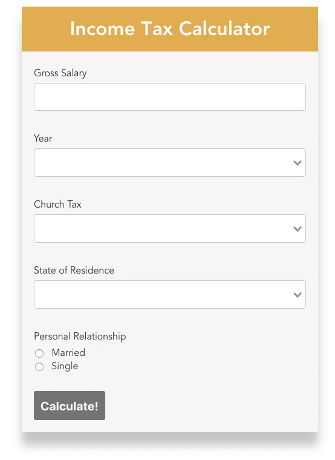
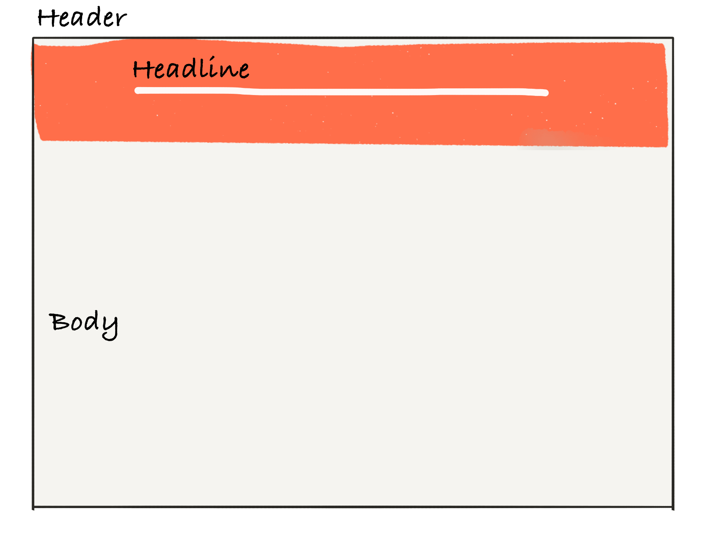
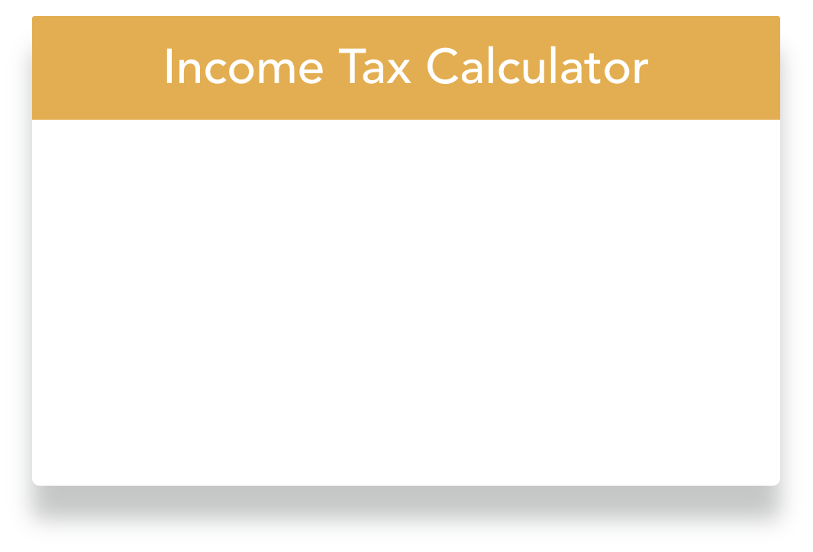
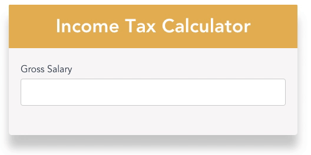
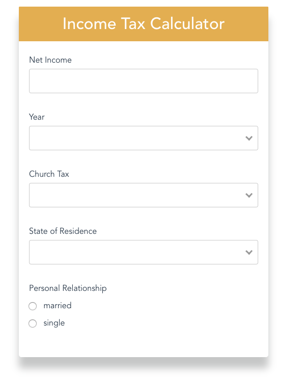
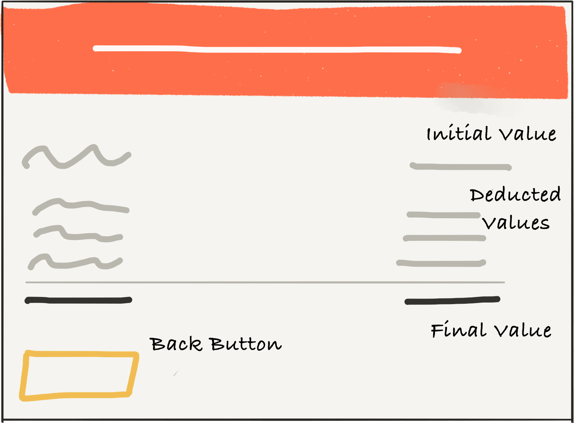
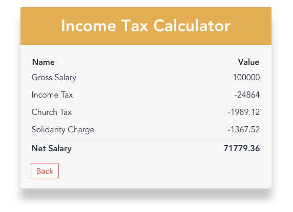

The concept of Progressive Web Apps (PWAs) is a framework agnostic approach which seeks to combine discoverability and accessibility of a website with the functionality of a native app.

Since couple of years I see an increasing interest technologies which bridge the gap between web- and native-apps.

In 2018 PWAs have made a great step towards mainstream adoption. By now, plenty of companies like [Pinterest](https://medium.com/@Pinterest_Engineering/a-one-year-pwa-retrospective-f4a2f4129e05), [Uber](https://eng.uber.com/m-uber/), [Twitter](https://love2dev.com/blog/twitter-pwa-windows-store/), [Trivago](https://www.thinkwithgoogle.com/intl/en-gb/consumer-insights/trivago-embrace-progressive-web-apps-as-the-future-of-mobile/), [The Washington Post](https://www.washingtonpost.com/pr/wp/2016/05/19/the-washington-post-introduces-new-progressive-web-app-experience/?noredirect=on&utm_term=.ce62df91e3ab), [Starbucks](https://formidable.com/work/starbucks-progressive-web-app/), have already created PWAs to run parallel to their native apps.

The reason is obvious, plenty of these companies report very promising numbers, mostly as astonishing as the [97 percent](https://www.thinkwithgoogle.com/intl/en-gb/consumer-insights/trivago-embrace-progressive-web-apps-as-the-future-of-mobile/) of increase in conversions Trivago has seen.

> Why should we start developing PWAs now?

In fact, in 2018 also the majority of browser vendors started backing the technology behind PWAs. Microsoft committed to bring PWAs to “more than [half a billion devices](https://blogs.windows.com/msedgedev/2018/02/06/welcoming-progressive-web-apps-edge-windows-10/) running Windows 10”. Google even went as far as calling it the future of app development — no surprise that [Lighthouse](https://developers.google.com/web/tools/lighthouse/), Google’s tool for improving the quality of web pages, audits ‘PWA’, next to ‘SEO and ‘Accessibility’ of webapps. And even Apple has finally started to support PWAs in 2018, even though, PWAs are a clear threat to Apple’s app store business.

This article is the first part of a tutorial series that teaches you how to develop a PWA in VueJS!

**Part I — Build the Tax Calculator App in VueJS.**

[Part II — Make the App work offline.](https://hinsencamp.com/article/service-worker/)

To make it easy for you to follow, check out this [Github Repo](https://github.com/fh48/vue-calculator-pwa). You can checkout a branch for each section!

# The Tax Calculator App

In this tutorial we will build an income tax calculator. Why?



Because calculating income tax (at least in Germany) is complicated and people would love an app that solves that problem for them. Besides that, it’s also a opportunity to explore the impact of the PWA features mentioned above.

We will use VueJS for this tutorial, as it comes with a great template which makes it easy to kick off a PWA project. Another reason is, that VueJS is really easy to learn. No prior experience in any other frontend framework required!

Enough theory for now, it’s time to get our hands dirty!

## Let’s create the App’s Skeleton

We start-off with creating the basic setup and the file structure of our app. To speed things up, we will bootstrap the app with vue-cli. First, we need to install the vue CLI tool globally.

`yarn global add @vue/cli`

Now we can instantiate the template by

`vue init pwa vue-calculator-pwa`

We will be prompted to pick a preset — I recommend the following configuration:

```bash
? Project name vue-calculator-pwa
? Project short name: fewer than 12 characters to not be truncated on homescreens (default: same as name) vue-calculator-pwa
? Project description A simple tax calculator
? Author Fabian Hinsenkamp <fabian.hinsenkamp@online.de>
? Vue build runtime
? Install vue-router? No
? Use ESLint to lint your code? Yes
? Pick an ESLint preset Standard
? Setup unit tests with Karma + Mocha? No
? Setup e2e tests with Nightwatch? No
```

For the Vue build configuration we can choose the smaller `runtime` option as we don’t need the compiler as the html we write inside our `\*.vue` files is pre-compiled into JavaScript at build time.

We don’t add tests here for brevity reasons. If we would set up a project for for production definitely add them.

Next, run `yarn` to install all dependencies. To start the development mode just run `yarn start`.

> Don’t get confused by all the files in the project — For now we won’t touch most of them. If you want to learn more about the template’s structure check out the [documentation](https://vuejs-templates.github.io/webpack/structure.html). I can only recommend it!

In the project we will find files with the `.vue` extension. It indicates that this file is a single-file vue component. It is one of the Vue’s features. Each file consists of three types of blocks: `<template>`, `<script>`, `<style>`. That way, we can easily divide the project into loosely-coupled components.

Let’s start creating all the `*.vue` files our app consists off.

### App.vue

Create the file `src/App.vue`. It is our main view and it will contain our different components which make up our calculator.

```javascript
<template>
  <div id="app">
    <main>
    </main>
  </div>
</template>

<script>
import Panel from "./components/Panel.vue";
import InputForm from "./components/InputForm";
import Result from "./components/Result";
import { calcTaxes } from "./calc.js";
export default {
  name: "app",
  components: {
    Panel,
    InputForm,
    Result
  }
};
</script>

<style lang="scss" src="./assets/styles/App.scss"/>
```

### InputForm.vue

Next let’s create the inputForm file `src/components/InputForm.vue`. It will handle all user inputs required to calculate the income taxes.

```javascript
<template>

</template>

<script>
export default {
  name: "InputForm"
};
</script>

<style lang="scss" src="../assets/styles/InputForm.scss"/>

```

Moreover, we create `.vue` skeleton files for the following `Result`, `Panel` ,`Input` components including a style sheet named identically to the component it belongs to. All of them belong into the `src/components` folder.

### Result.vue

It will display the results of our calculations.

### Panel.vue & Input.vue

The panel is a simple component that wraps the input and result components.

Finally, we should remove the `Hello.vue` file, that comes with the vue template.

## Add Styles & Calculation Logic

Next, we add the following libraries to support sass/scss files.

```bash
yarn add node-sass sass-loader -D
```

For now, the scss files we added are all empty.

> I won’t talk about styles in this tutorial as there is nothing specific about applying styles to app.

Hence, you have two options, create your own styles or checkout the following branch of the [github repo](https://github.com/fh48/vue-calculator-pwa).

```bash
git checkout 01_skeletonApp
```

We also need logic to calculate our income tax. I use the real German income tax formular. To spare the details, I also added it to the branch.

It also contains some css animations for the input validation message. In case you don’t want to use the branch above, you can also add them manually:

```bash
yarn add animation.css
```

## Let’s create the Panel Component!



Now we can start coding! To warm you up, we start with building the panel component. It’s good practice to keep such components generic so it can be reused holding any kind of content. That’s why we aim to pass the headline as well as the html for the body to the component.

Let’s add the following code to the template section of the `panel.vue` file.

```javascript
<template>
  <div class="panel">
    <div class="header">
      <h2 class="headline">{{ headline }}</h2>
    </div>
    <div class="body">
      <slot />
    </div>
  </div>
</template>
```

For one-way data binding in VueJS, we can use [text interpolation](https://vuejs.org/v2/guide/syntax.html#Text). That’s exactly what we do to render the headline. Therefore, we simply need to wrap our headline data object in double curly braces. Attention, this “Mustache” syntax interprets data always as plain text, not HTML.

That’s why we also use vue’s slot element, which allows us to render child elements of our panel component within the body element. Now we are done with the html for the panel component, next we define our script logic.

```javascript
<script>
export default {
  name: "Panel",
  props: {
    headline: String,
  }
};
</script>
```

First, it’s important to add a name to the component so we can actually register the component and import it later on. As we want to pass the headline to the panel, we should specify it as properties. Properties are custom attributes we can register on a component.

```javascript
<template>
      <Panel class="calculator-panel" headline="Income Tax Calculator">
        <template>
        <span>content goes here.<span/>
        </template>
      </Panel>
</template>
```

To see the panel in our app, just add the code above to our `app.vue` component.



In the script block we already import the component so adding the html is all we need to add our first component to the app!

We should see the panel when we run `yarn start`.

If we have any problems implementing the panel or want to skip this section check the following branch: `git checkout 02_panel`

## Let’s create the Input Component!


Next we build our input form with some neat custom input validation.

We have three types of inputs: _regular_, _select_ and _radio_.

Except the radio buttons these inputs need input validation and corresponding user feedback. To avoid repeating ourselves, we should build a reusable input component. To build a component which is actually reusable, I advice to build it in a way, that allows to easily extend it without changing the whole architecture.

Defining a clean and thought through component api is a great starting point.

In our case, we always want to control four properties from outside of the component:

- label

- input type

- validation rule

- data-binding

Let’s translate these requirements into code! The input.vue component looks like the following:

```javascript
<template>
  <div class="input-wrapper">
    <label>{{label}}</label>
    <input
      class="input"
      v-if="type==='input'"
      @input="customInput($event.target.value)"
      autocomplete="off"
      type="text"
    >
</template>
<script>
export default {
  name: "Input",
  props: {
    type: String,
    label: String,
    validation: String,
  }
}
</script>
```

We add some custom vue-attributes to the native input component. First we add `v-if`, which allows us to render the input only if we pass the correct type to our component. This is important to add different types of inputs. Next, we bind to the component’s input event with the `@-prefix` to a method called `customInput`.

Thats where our custom input validation comes to play. We add a validation library to the project by running

`yarn add vee-validate` and register the plugin in our `main.js` file.

```javascript
import VeeValidate from "vee-validate";

Vue.use(VeeValidate);
```

Our validation consists in intercepting the native input event and then check if the entered values meet our validation rule. In case it doesn’t we set an error message. Therefore, we add two methods to the `input.vue` file. The `customInput` method is triggered when the user enters any input.

```javascript
<script>
import { Validator } from "vee-validate";
const validator = new Validator();
...
data() {
    return {
      validationError: ""
    };
  },
  methods: {
    validate(value) {
      return validator.verify(value, this.validation, {
        name: this.label
      });
    },
    async customInput(value) {
      const { valid, errors } = await this.validate(value);
      if (valid) {
        this.validationError = "";
        this.$emit("input", value);
      } else {
        this.validationError = errors[0];
        this.$emit("input", "");
      }
    }
  }
</script>
```

The validation error message is returned from the `v-validate` plugin. We only have to add some html to show it to the user:

```javascript
<template>
  ...
  <transition
    name="alert-in"
    enter-active-class="animated flipInX"
    leave-active-class="animated flipOutX"
  >
    <p v-if="validationError" class="alert">
      {{ validationError }}
    </p>
  </transition>
</template>
```

I add a transition to the error message. VueJS comes with a transition wrapper, combined with the flip-animation from `animate.css` and some styles, we can get a nice error message without any hassle.

```javascript

<template>
  <form>
    <Input
      type="input"
      label="Net Income"
      validation="required|numeric"
      v-model="inputs.incomeValue"
      @input="input"
    />
  </form>
</template>

<script>
import Input from "./Input";
export default {
  name: "InputForm",
  components: {
    Input
  },
  data() {
    return {
      inputs: {
        incomeValue: ""
      }
    };
  }
};
</script>
```

To add the new input to the app, register the completed Input component to the `InputForm.vue`.

Here we apply two-way-binding through `v-model` — It automatically picks the correct way to update the element based on the input type. Now, we need to open `App.vue`, import `InputForm` as we did with Panel and replace <span> content goes here. </span> with `<InputForm/>`.



The result should look like what you see above.

Check the branch for more details!

```bash
git checkout 03_basicInput
```

## Add More Input Types!

Now that we have a basic input with validation in place, it’s easy to extend our input component with the remaining two input types — the select and radio input.

For the select element we use an out-off-the-box component. We simply add it by running:

```bash
yarn add vue-select
```

Before we can use it, it needs to be registered in the main.js file similar to the `v-validate` plugin before. However, this time we use the `Vue.component` method.

```javascript
import vSelect from 'vue-select'
...
Vue.component('v-select', vSelect)
```

Now simply add the component to our `Input.vue` file. The options we want to show in the dropdown will be passed to the component as props.

```javascript
<template>
...
 <v-select
      v-if="type ==='dropdown'"
      class="input-dropdown"
      @input="customInput"
      :options="options"
    />
</template>
<script>
...
export default {
...
props {
     ...
     options: Array
}

```

Now there are only the radio buttons left to add.

//radio buttons

We start off with the native html element. Even though we just need two radio buttons atm, I advice to build the component in a way that allows to pass an arbitrary number of inputs. Therefore, we simply use vue’sv-for attribute to loop over the options property and create a radio button for each element of the option array.

```javascript
<template>
 <div
  v-if="type ==='radio'"
  v-for='option in options'
  :key='option.label'
 >
 <input
  type="radio"
  class="radio"
  :id="option.label"
  :value="option.value"
  :checked="value === option.value"
  @input="customInput($event.target.value)"
  >
   <label :for="option.label">{{option.label}}</label>
  </div>
...
</template>

<script>
...
  props: {
    ...
    value: [String, Object, Boolean]
  }
...
 </script>
```

Additionally, we need to pass the currently selected value in order to manage the ‘checked’ state of the radio button inputs. In the script block we add an array holding all possible value types.

To test our new input types, we need to actually add them to the submit form and pass options to the select and radio input.



Check out the `inputForm.vue` file in the following branch to see how the options are passed to the new inputs.

```bash
git checkout 04_completeInputs
```

It follows the same pattern we have investigated for the regular input in detail.

Most importantly, keep in mind to always pass an object containing a value and a label.

That’s it! We managed to create a component that allows us to add all the input types we need and validate them without repeating ourselves!

## Let’s finalise our input form!

Now we can finalise the input form. The only thing missing is the button to submit the form.

```javascript
<template>
 <form @submit.prevent="handleSubmit">
  ...
  <button
   class='submit-btn'
   :disabled="!isEnabled"
   type="submit"
  >
   Calculate!
  </button>
 </form>
</template>
<script>
...
  computed: {
      isEnabled: function() {
        return !!Object.values(this.inputs).every(Boolean);
      }
    },
    methods: {
      input: function(input) {
        if (input.type === "input") {
         this.incomeValue = input.value;
        }
      },
      handleSubmit: function() {
        const { isInChurch, stateOfResidence } = this.inputs;
        const inputValues = {
          ...this.inputs,
          yearValue: yearValue.value,
          isInChurch: isInChurch.value,
          stateOfResidence: stateOfResidence.value
        };
        this.$emit("submitted", inputValues);
      }
    }
</script>
```

We start with preventing the default html form event, and call our custom method handleSubmit instead.

There we clean our input results — Although our dropdown and radio buttons require return objects with label and value, we are only interested in the value to calculate the results.

Finally, we create a custom event which emits only the values of our input options.

We also create a computed property which enables our “calculate” button only after all required data is entered by the user.

You find the completed input form on the branch I mentioned already above.

```bash
git checkout 04_completeInputs
```

## Let’s calculate Taxes!

Now we are already able to get the inputs from the user, next we need to actually calculate the resulting income taxes. As I mentioned in the very beginning, I want to spare you the details about how the different types of deductions are calculated. In case you are interested anyhow check out the `calc.js` file.

```javascript
<template>
...
  <InputForm @submitted="submitted" />
...
</template>
<script>
...
import { calcTaxes } from "./calc.js";
export default {
...
  data() {
    return {
      calculations: {}
    };
  },
  methods: {
    submitted: function(input) {
      const calcValues = calcTaxes(input);
      this.calculations = {
        grossIncome: { label: "Gross Salary", value: calcValues.incomeValue },
        tax: { label: "Income Tax", value: -calcValues.incomeTax },
        churchTax: { label: "Church Tax", value: -calcValues.churchTax },
        soli: { label: "Solidarity Charge", value: -calcValues.soli },
        netIncome: { label: "Net Salary", value: calcValues.netIncome }
      };
    },
  }
};
</script>
```

Most importantly, we understand that we use the custom submitted event to pass the inputs back to our app.vue component. Here we also calculate the actual taxes and store the resulting values with labels, and add negative signs to the values we deduced from the gross income.

— Why? It makes displaying the results very simple as we will see in the next section.

## Let’s display our Results!

Now we have everything we need to finally show the results of our tax calculations.



Therefore, we use a native html table to show the label and the corresponding value in a structured manner.

The implementation is quite simple, as we can stick to what we have learned about VueJS already. In fact, we repeat what we have done for the radio input already.

We just pass our calculations as props to the results component and loop over our results object.

```javascript
<template>
  <div>
    <table>
      <tr class="table-head">
        <th class="name">Name</th>
        <th class="value">Value</th>
      </tr>
      <tr
        v-for='result in results'
        :key="result.label"
      >
        <td>{{result.label}}</td>
        <td class="value">
          {{result.value}}
        </td>
      </tr>
    </table>

    <button
      v-on:click="handleBackClick"
      class="btn-back"
    >
      Back
    </button>
  </div>
</template>

<script>
export default {
  name: "Result",
  props: {
    results: Object
  },
  methods: {
    handleBackClick: function() {
      this.$emit("clearCalculations");
    }
  }
};
</script>
```

As users probably want to perform multiple calculations without refreshing the page, we add another button, that leads users back to the input form.

Therefore, we simply emit a custom event called clearCalculations to clear our calculations property in the parent component. Finally, we are also tying all our components together and complete our income tax calculator.



As always, checkout the branch I you want to have a more detailed look at the code.

```bash
git checkout 05_result
```

## Let’s finalise our App!

In this last section there is only, two things left to do — complete the data-flow and manage the lifecycle of the input and result component accordingly.

in the `Result.vue` component we just added a button which emits the `clearCalculation` event. On the left, we see our main component App.vue. Here we subscribe to the event and reset the calculations object to be empty.

Now, we want to only render the input or the result component.

```javascript
<template>
  <div id="app">
    <main>
      <Panel
        class="calculator-panel"
        headline="Income Tax Calculator"
      >
        <template>
          <transition
            name="alert-in"
            mode="out-in"
            enter-active-class="animated fadeIn"
            leave-active-class="animated fadeOut"
          >
            <InputForm
              v-if="!resultsCalculated"
              @submitted="submitted"
            />
            <Result
              v-if="resultsCalculated"
              @clearCalculations='clearCalculations'
              :results="calculations"
            />
          </transition>
        </template>
      </Panel>
    </main>
  </div>
</template>

<script>
...
export default {
  ...
  data() {
    return {
      calculations: {}
    };
  },
  computed: {
    resultsCalculated: function() {
      return Object.keys(this.calculations).length !== 0;
    }
  },
  methods: {
   ...
   clearCalculations: function() {
    this.calculations = {};
   }
  }
};
</script>
```

Therefore, we add another `computed` boolean property, which checks if we have calculation results or not.

Now, we add `v-if` attributes to our components based on our `resultsCalculated` prop.

Try it out! Now we should see the table with the results only after we have successfully entered our inputs.

To make the switch between input and results less harsh we add a transition. As we are replacing the one with the other component here, we use the `mode` attribute `out-in` so that, the current element transitions out first, then when complete, the new element transitions in.

We completed the tutorial! Well done! The branch with the finale application code is the following

```bash
git checkout 06_complete
```

## Conclusion

We have successfully kickstarted the implementation of our income tax calculator PWA based on vue’s PWA template. Thereby, we familiarised ourselves with the syntax and paradigms of VueJS.

So far so good but we are still far-off from providing a user experience close to a native app. This is what [Part II](https://hinsencamp.com/article/service-worker/) of this tutorial will focus on.

## Credits

Originally posted on [hackernoon](https://hackernoon.com/a-progressive-web-app-in-vue-tutorial-part-1-the-vue-app-f9231b032a0b).
